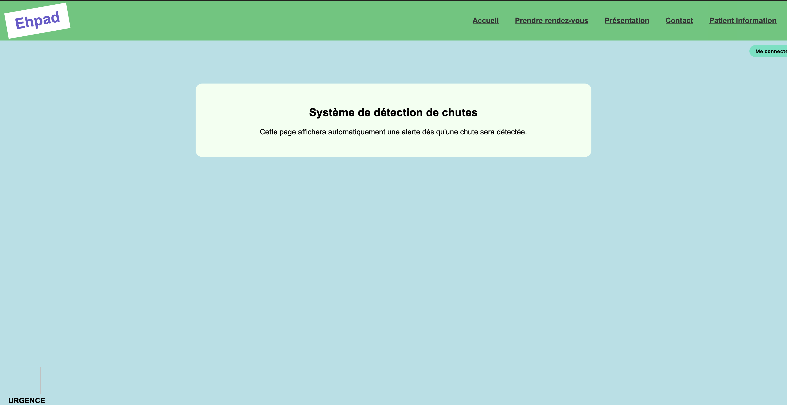
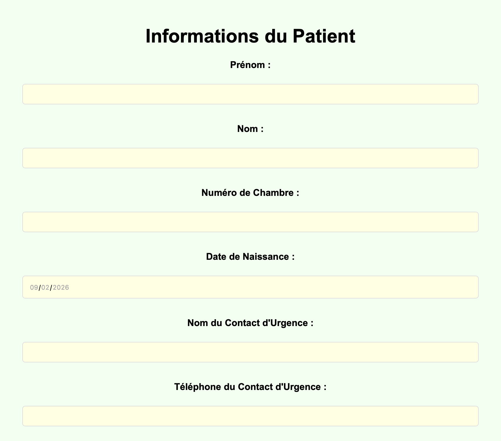

  

# 🏥 Système d'Alerte de Chute - EHPAD

> **Une solution de sécurité réactive conçue pour assister le personnel soignant et garantir la sécurité des résidents.**

Ce projet est une application web interactive permettant de surveiller les chutes en temps réel. En cas d'incident, le système déclenche une alerte visuelle et sonore immédiate, fournissant les informations vitales du résident pour une intervention rapide.

---

## 🚀 Fonctionnalités principales

* **⚠️ Alerte de Chute Instantanée** : Pop-up prioritaire avec signal sonore dès qu'une chute est détectée.
* **📋 Dossier Médical d'Urgence** : Affichage des antécédents, médicaments et allergies du résident concerné.
* **📞 Protocoles SOS** : Boutons d'appel direct vers la famille, les pompiers (18) ou le SAMU (15).
* **📂 Registre des Patients** : Formulaire complet pour la gestion et l'enregistrement des données médicales.
* **📱 Interface Responsive** : Design adapté pour une utilisation sur tablette ou ordinateur de soin.

---

## ✨ Aperçu de l'Interface

### 🏠 Tableau de Bord Surveillance
L'interface principale reste en veille active, prête à afficher une alerte dès qu'un capteur détecte une anomalie.

### 🚨 Alerte Critique (Popup)
Lors d'une chute, cette fenêtre s'affiche par-dessus toutes les autres activités. Elle contient les coordonnées exactes et la fiche médicale pour guider les secours.

### 📝 Fiche Patient & Informations
Une section dédiée permet au personnel de renseigner les détails critiques pour chaque résident.

---

## 🛠️ Stack Technique

* **Structure** : HTML5 (Sémantique médicale).
* **Style** : CSS3 (Animations d'alerte "pulse" et design système épuré).
* **Logique** : JavaScript Vanilla (Déclenchement des alertes, gestion sonore et appels SOS).

---

## 📂 Structure des fichiers

* `index.html` : Coeur du système (Surveillance et Alertes).
* `patient_info.html` : Interface d'administration des données patients.
* `script.js` : Gestionnaire d'événements et protocole d'urgence.
* `styles.css` : Charte graphique et mise en page responsive.

---

> **Note** : Ce projet est une preuve de concept (PoC) visant à réduire le temps d'intervention des secours en milieu hospitalier et en EHPAD.
